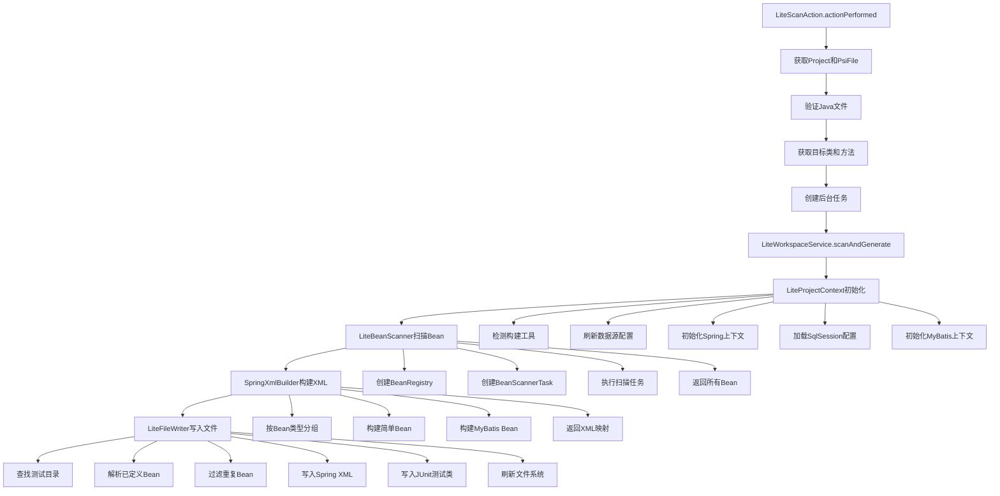
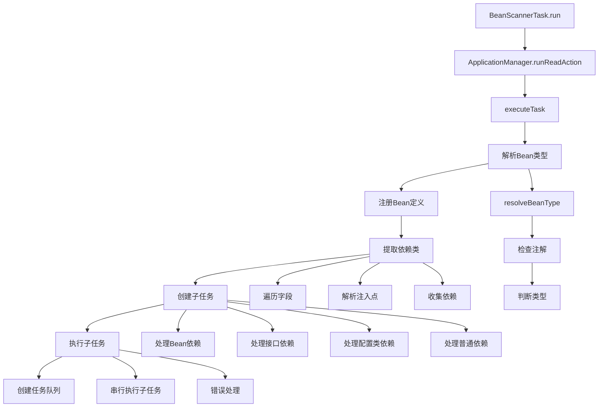
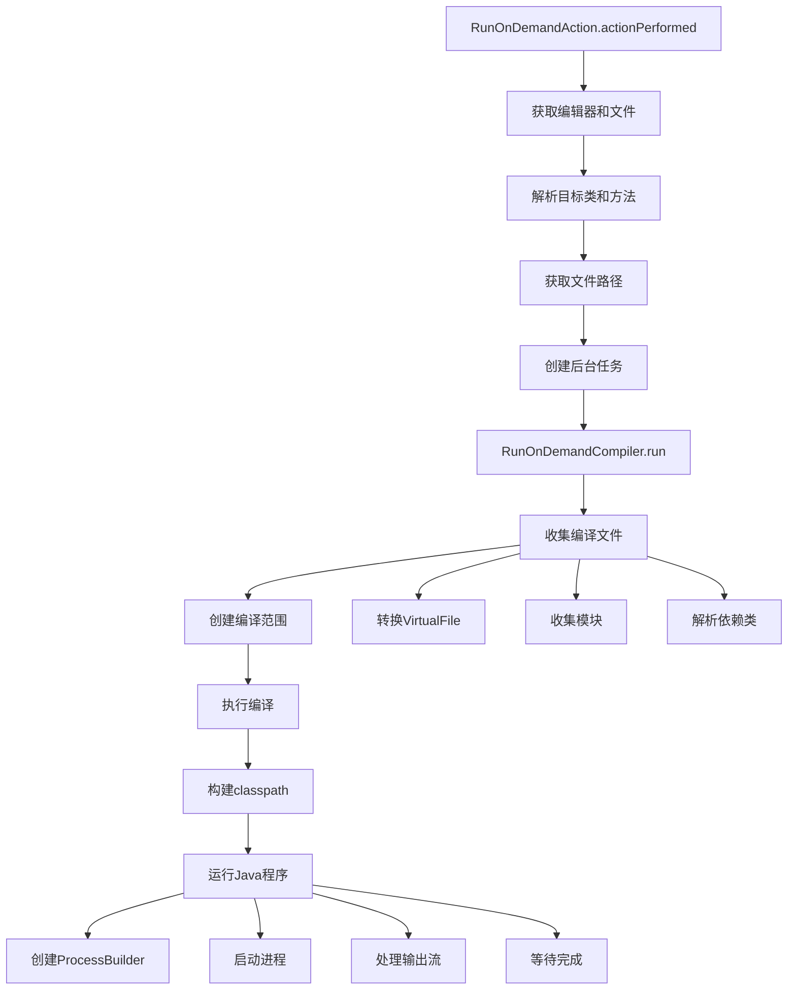
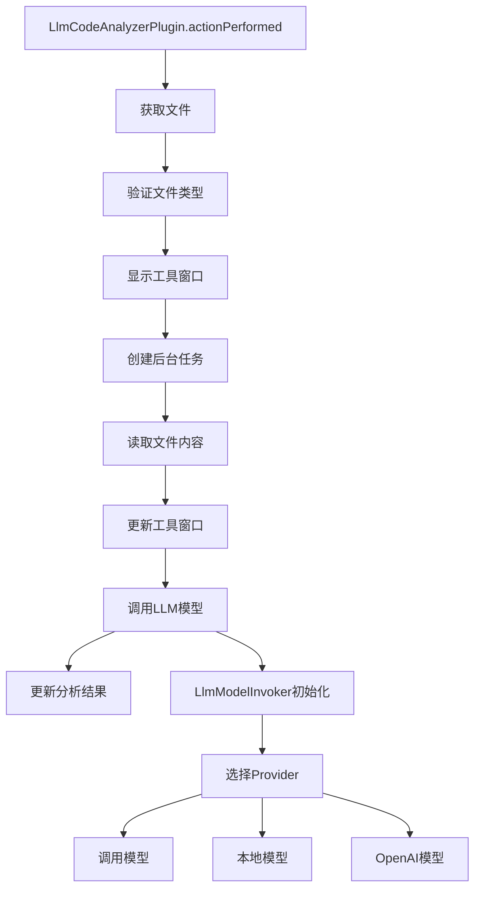
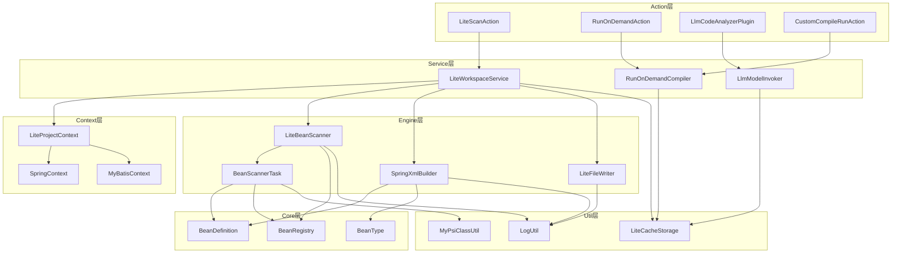
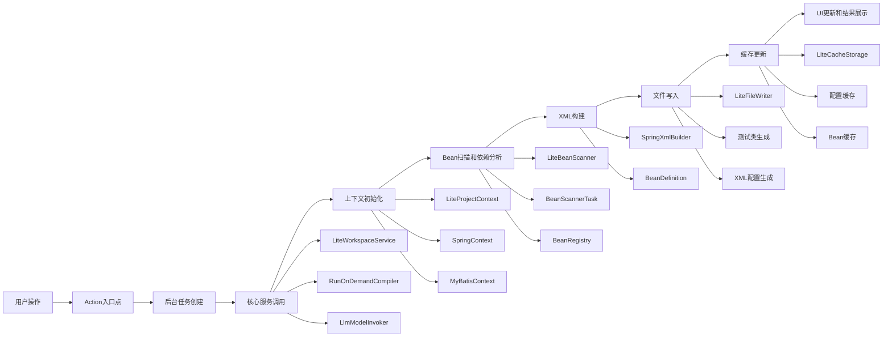

# LiteWorkspace项目Action功能调用关系图

## 概述

LiteWorkspace是一个IntelliJ IDEA插件，主要用于自动化生成Spring测试类和配置文件。本文档详细描述了从Action入口到功能结束的完整调用链路。

## Action入口点

项目中有5个主要的Action入口类：

1. **CompileAndRunDialog** - 编译和运行对话框
2. **CustomCompileRunAction** - 自定义编译运行Action
3. **LiteScanAction** - 核心扫描Action
4. **LlmCodeAnalyzerPlugin** - LLM代码分析插件
5. **RunOnDemandAction** - 按需运行Action

## 1. LiteScanAction调用链路（核心功能）

### 1.1 入口触发
```
LiteScanAction.actionPerformed(AnActionEvent e)
├── 获取Project和PsiFile
├── 验证是否为Java文件
├── 获取目标类(targetClass)和方法(targetMethod)
└── 创建后台任务执行扫描和生成
```

### 1.2 核心服务调用
```
Task.Backgroundable.run()
└── ApplicationManager.runReadAction()
    └── LiteWorkspaceService.scanAndGenerate(targetClass, targetMethod)
```

### 1.3 LiteWorkspaceService核心流程
```
LiteWorkspaceService.scanAndGenerate()
├── 初始化项目上下文
│   └── new LiteProjectContext(project, targetClass, targetMethod, null)
├── 扫描Bean依赖
│   └── new LiteBeanScanner(projectContext).scanAndCollectBeanList(targetClass, project)
├── 生成Spring XML
│   └── new SpringXmlBuilder(projectContext).buildXmlMap(beans)
└── 写入文件
    └── writeFiles(projectContext, targetClass, beanMap, beans)
```

### 1.4 LiteProjectContext初始化
```
LiteProjectContext.<init>()
├── 检测构建工具类型(Maven/Gradle)
│   └── detect(project)
├── 刷新数据源配置
│   └── refreshDatasourceConfig()
├── 初始化Spring上下文
│   └── new SpringContext(project)
│       └── refresh(miniPackages)
├── 加载SqlSession配置
│   └── DataSourceConfigLoader.load(project)
└── 初始化MyBatis上下文
    └── new MyBatisContext(project, sqlSessionConfigList)
        └── refresh()
```

### 1.5 LiteBeanScanner扫描流程
```
LiteBeanScanner.scanAndCollectBeanList()
├── 创建BeanRegistry
├── 创建根任务
│   └── new BeanScannerTask(rootClass, registry, context, visited, normalDependencies)
├── 执行根任务
│   └── rootTask.run()
└── 返回所有扫描到的Bean
    └── registry.getAllBeans()
```

### 1.6 BeanScannerTask执行流程
```
BeanScannerTask.run()
└── ApplicationManager.runReadAction()
    └── executeTask()
        ├── 解析当前类Bean类型
        │   └── resolveBeanType(clazz)
        ├── 注册Bean定义
        │   └── registry.register(new BeanDefinition(...))
        ├── 提取依赖类
        │   └── extractDependencies(clazz)
        ├── 为每个依赖创建子任务
        │   └── new BeanScannerTask(dependency, ...)
        └── 执行子任务
            └── executeSubTasksWithQueue(subTasks)
```

### 1.7 SpringXmlBuilder构建流程
```
SpringXmlBuilder.buildXmlMap()
├── 按Bean类型分组
│   └── grouped.computeIfAbsent(bean.getType(), ...)
├── 构建简单Bean
│   ├── buildSimpleBeans(grouped, xmlMap, BeanType.ANNOTATION)
│   ├── buildSimpleBeans(grouped, xmlMap, BeanType.MAPPER_STRUCT)
│   ├── buildSimpleBeans(grouped, xmlMap, BeanType.JAVA_CONFIG)
│   └── buildSimpleBeans(grouped, xmlMap, BeanType.MAPPER)
├── 构建MyBatis Bean
│   └── buildMyBatisBeans(grouped, xmlMap)
└── 返回XML映射
    └── return xmlMap
```

### 1.8 LiteFileWriter写入流程
```
LiteFileWriter.write()
├── 查找测试目录
│   ├── findTestSourceFolder(module, clazz, "java")
│   └── findTestSourceFolder(module, clazz, "resources")
├── 解析已定义Bean
│   └── parseDefinedBeans(context.getDatasourceConfig().getImportPath())
├── 过滤重复Bean
│   └── beanMap.keySet().removeIf(definedBeanClasses::contains)
├── 写入Spring XML文件
│   └── writeSpringXmlFile(beanMap, resourcesTestDir, testClassName)
├── 写入JUnit测试类
│   └── writeJUnitTestFile(packageName, className, testClassName, ...)
└── 刷新文件系统并打开文件
    ├── VfsUtil.findFileByIoFile(xmlFile, true).refresh()
    └── FileEditorManager.getInstance(project).openFile(virtualTestFile, true)
```

## 2. RunOnDemandAction调用链路

### 2.1 入口触发
```
RunOnDemandAction.actionPerformed(AnActionEvent e)
├── 获取Project、Editor和PsiFile
├── 获取光标位置的PsiElement
├── 解析目标方法和类
├── 获取主类信息和文件路径
└── 创建后台任务执行编译运行
```

### 2.2 编译运行流程
```
Task.Backgroundable.run()
├── 加载缓存
│   └── new LiteCacheStorage(project).loadJavaPaths()
├── 调用编译运行器
│   └── RunOnDemandCompiler.run(project, mainClass, objects)
└── 错误处理
    └── showError(project, "❌ 编译失败：" + ex.getMessage())
```

### 2.3 RunOnDemandCompiler编译流程
```
RunOnDemandCompiler.run()
├── 收集需要编译的文件
│   ├── 遍历javaFilePaths，转换为VirtualFile
│   ├── 收集相关模块
│   └── 自动解析import的依赖类
│       └── collectImportsAndRelatedFiles(project, vf, filesToCompile)
├── 创建编译范围
│   └── CompilerManager.getInstance(project).createFilesCompileScope(...)
├── 执行编译
│   └── CompilerManager.getInstance(project).make(scope, callback)
├── 构建classpath
│   └── 收集所有模块的编译输出路径
└── 运行Java程序
    ├── 创建ProcessBuilder
    ├── 启动进程
    └── 处理输出流
        ├── printStream(process.getInputStream(), ConsoleViewContentType.NORMAL_OUTPUT)
        └── printStream(process.getErrorStream(), ConsoleViewContentType.ERROR_OUTPUT)
```

## 3. LlmCodeAnalyzerPlugin调用链路

### 3.1 入口触发
```
LlmCodeAnalyzerPlugin.actionPerformed(AnActionEvent e)
├── 获取Project和VirtualFile
├── 验证文件类型
├── 显示工具窗口
│   └── ToolWindowManager.getInstance(project).getToolWindow(TOOL_WINDOW_ID).show()
└── 创建后台任务执行代码分析
```

### 3.2 代码分析流程
```
Task.Backgroundable.run()
├── 读取文件内容
│   └── new String(file.contentsToByteArray(), StandardCharsets.UTF_8)
├── 更新工具窗口内容
│   └── LlmAnalysisToolWindow.updateTextArea(project, content)
├── 调用LLM模型
│   ├── new LlmModelInvoker()
│   └── invoker.invoke(prompt)
└── 更新分析结果
    └── LlmAnalysisToolWindow.updateTextArea(project, outputText)
```

### 3.3 LlmModelInvoker调用流程
```
LlmModelInvoker.<init>()
├── 获取配置
│   └── LiteWorkspaceSettings.getInstance()
├── 根据配置选择Provider
│   ├── "local" -> new DifyLlmProvider()
│   └── 其他 -> new OpenAiLlmProvider(settings.getApiKey(), settings.getApiUrl())
└── 调用模型
    └── provider.invoke(prompt)
```

## 4. CustomCompileRunAction调用链路

### 4.1 入口触发
```
CustomCompileRunAction.actionPerformed(AnActionEvent e)
├── 获取Project和PsiElement
├── 执行增量编译
│   └── CompilerManager.getInstance(project).make(module, callback)
└── 编译成功后运行
    ├── 创建JUnit运行配置
    │   └── createJUnitRunConfig(project, element)
    └── 执行配置
        └── ProgramRunnerUtil.executeConfiguration(configuration, executor)
```

### 4.2 JUnit配置创建
```
CustomCompileRunAction.createJUnitRunConfig()
├── 获取配置类型
│   └── ConfigurationTypeUtil.findConfigurationType(JUnitConfigurationType.class)
├── 创建配置实例
│   └── runManager.createConfiguration("CustomRun", factory)
└── 配置测试目标
    ├── PsiClass -> config.beClassConfiguration((PsiClass) element)
    └── PsiMethod -> config.beMethodConfiguration(MethodLocation.elementInClass(method, containingClass))
```

## 5. 核心支持组件

### 5.1 SpringContext组件
```
SpringContext.refresh()
├── 扫描组件扫描包
│   └── new SpringConfigurationScanner().scanEffectiveComponentScanPackages(project)
├── 获取配置类
│   └── getConfigurationClasses(miniPackages)
│       ├── 遍历包前缀
│       ├── 搜索@Configuration类
│       ├── 解析@Bean方法
│       └── 建立Bean到配置类的映射
└── 更新上下文状态
    ├── componentScanPackages.addAll(...)
    ├── bean2configuration.putAll(...)
    └── configurationClasses.addAll(...)
```

### 5.2 MyBatisContext组件
```
MyBatisContext.refresh()
├── 创建MyBatis XML查找器
│   └── new MyBatisXmlFinder(project)
├── 扫描所有Mapper XML
│   └── myBatisXmlFinder.scanAllMapperXml(sqlSessionConfigList)
└── 更新命名空间映射
    └── namespace2XmlFileMap.putAll(namespace2dao)
```

### 5.3 LiteCacheStorage组件
```
LiteCacheStorage
├── 构造函数
│   └── 创建项目特定的缓存目录
├── 配置类缓存
│   ├── saveConfigurationClasses(Map<String, PsiClass> configClasses)
│   └── loadConfigurationClasses()
├── Mapper XML缓存
│   ├── saveMapperXmlPaths(Map<String, MybatisBeanDto> namespaceToPath)
│   └── loadMapperXmlPaths()
├── 数据源配置缓存
│   ├── saveDatasourceConfig(DatasourceConfig config)
│   └── loadDatasourceConfig()
├── Spring扫描包缓存
│   ├── saveSpringScanPackages(Set<String> packages)
│   └── loadSpringScanPackages()
└── Bean列表缓存
    ├── saveBeanList(Collection<BeanDefinition> beans)
    └── loadJavaPaths()
```

## 6. 数据流向图

```
用户操作
    │
    ▼
Action入口点
    │
    ▼
后台任务创建
    │
    ▼
核心服务调用(LiteWorkspaceService/RunOnDemandCompiler/LlmModelInvoker)
    │
    ▼
上下文初始化(LiteProjectContext)
    │
    ▼
Bean扫描和依赖分析(LiteBeanScanner/BeanScannerTask)
    │
    ▼
XML构建(SpringXmlBuilder)
    │
    ▼
文件写入(LiteFileWriter)
    │
    ▼
缓存更新(LiteCacheStorage)
    │
    ▼
UI更新和结果展示
```

## 7. 关键设计模式

1. **策略模式** - LlmModelInvoker根据配置选择不同的LLM Provider
2. **模板方法模式** - BeanScannerTask定义了扫描流程的模板
3. **工厂模式** - SpringXmlBuilder根据Bean类型创建不同的XML配置
4. **观察者模式** - 编译完成后的回调机制
5. **命令模式** - Action类封装了用户操作命令

## 8. 性能优化点

1. **缓存机制** - LiteCacheStorage避免重复扫描和分析
2. **增量编译** - 只编译修改过的文件
3. **后台任务** - 使用Task.Backgroundable避免阻塞UI线程
4. **依赖分析优化** - 使用队列单线程执行子任务，避免死锁
5. **范围限制** - 根据组件扫描包限制搜索范围

## 9. 扩展点

1. **新的Bean类型支持** - 在BeanType枚举中添加新类型
2. **新的LLM Provider** - 实现LlmProvider接口
3. **新的构建工具支持** - 在BuildToolType中添加新类型
4. **新的文件类型支持** - 扩展文件扫描和解析逻辑
5. **新的配置源支持** - 扩展数据源配置加载逻辑

## 10. Mermaid调用关系图

### 10.1 LiteScanAction核心流程图



### 10.2 BeanScannerTask执行流程图



### 10.3 RunOnDemandAction编译运行流程图



### 10.4 LlmCodeAnalyzerPlugin分析流程图



### 10.5 整体架构关系图



### 10.6 数据流向图

